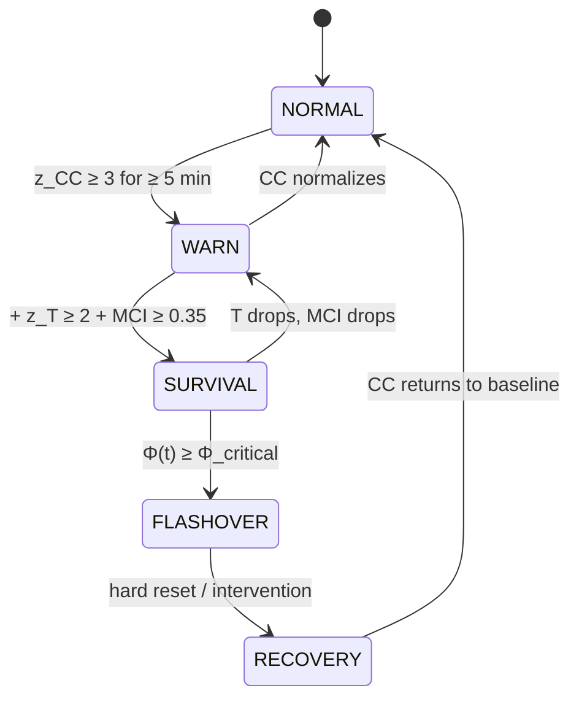

# ActProof

**Predictive Alignment Monitoring for AI Systems**

> Current alignment metrics tell you a fire is burning.
> ActProof tells you one is about to start.

---

> **Scope:** This repository (`ActProof-DS`) contains the **diagnostic science** — formal definitions, empirical validation, and proof-of-concept implementations of the Control Cost framework. It is a research/methodology repo, not a production platform. The production runtime (event registry, proof engine, orchestration) lives in separate repositories.

---

## What is ActProof?

ActProof is a diagnostic framework that measures **control cost** — the aggregate effort required by safety infrastructure to keep an AI system's output within acceptable boundaries. When this cost accelerates, the system is approaching **flashover**: the point where safety layers can no longer compensate for base model degradation.

The framework was developed and validated on strategic board games (Go/KataGo), where control cost dynamics reliably predict game-deciding transitions. It maps directly to production LLM monitoring.

### Key Insight

```
Your metrics:    "Safety score: 99.2% ✓"     (reactive — reports after failure)
ActProof:        "CC acceleration: +0.12/min"  (predictive — warns before failure)
```

Safety layers can mask base model degradation. Standard metrics show "all green" while the system becomes increasingly fragile. ActProof detects this hidden dynamic by measuring **how hard the safety infrastructure is working**, not just whether it succeeds.

---

## Core Concepts

### Control Cost — CC(t)

The minimum compensation needed to keep system output within constraints:

```
CC_turn = w1·policy_hits + w2·retries + w3·edit_ratio + w4·latency + w5·SemanticDist
```

Computable from observable signals. No access to model internals required.

**Metric definitions (default implementation — pluggable):**

| Metric | Definition | Default implementation |
|--------|-----------|------------------------|
| `policy_hits` | Safety filter activations per turn | Count of content-policy triggers |
| `retries` | Generation attempts before acceptable output | Integer count |
| `edit_ratio` | Fraction of output tokens modified by post-hoc rewriting | `len(diff_tokens) / len(original_tokens)` |
| `latency_overhead` | Additional latency from safety checks (ms) | `t_total - t_inference`, normalized to [0,1] by `min(x/1000, 1)` |
| `SemanticDist` | Semantic distance between pre-edit and post-edit output | Cosine distance of sentence embeddings (default: `all-MiniLM-L6-v2`), range [0,1] |

All components are normalized to [0, 1] before weighting. Weights are configurable; defaults calibrated on synthetic benchmarks. See [CCC v3.1](docs/CCC_v3.1.md) for formal specification.

### Tension — T(t)

System brittleness. How sensitive is CC to small input perturbations?

```
T_proxy ≈ ΔCC / ||Δx||
```

When nearly identical prompts produce wildly different compensation costs, the system is fragile.

### Module Coupling Index — MCI

Which compensator absorbs the most cost? Rising `MCI(DG→SCE)` means the safety rewriting module handles an increasing share — the base model is degrading while safety masks it.

### Flashover

The critical transition: compensation cost exceeds cascade capacity. The system can no longer maintain aligned behavior at any affordable cost.

### State Machine



---

## Repository Structure

```
ActProof-DS/
├── README.md                    ← you are here
├── LICENSE                      ← MIT License
│
├── docs/                        ← formal framework documents
│   ├── UDM.md                   ← Universal Diagnostic Model (CC, T, Φ definitions)
│   ├── CCC_v3.1.md              ← Compensator Cost Cascade (operational pipeline)
│   ├── Bridge_Note.md           ← Channel coupling detection (perturbation-response)
│   ├── DM_v1.3.2.md             ← Latent tension & relaxation time
│   ├── Nano_Channels.md         ← Channel capacity C(h) and regime classification
│   └── whitepaper/
│       ├── ActProof_WhitePaper_EN.pdf
│       └── ActProof_WhitePaper_PL.pdf
│
├── go-analysis/                 ← empirical validation on Go (KataGo)
│   ├── README.md                ← methodology + key results
│   ├── scripts/
│   │   ├── compute_cc.py        ← compute CC(t) from KataGo dual-budget output
│   │   ├── detect_flashover.py  ← M37 Bridge criteria (LCE/GAS/OBS/RC/NLE)
│   │   └── visualize.py         ← CC curve + ranking plots (matplotlib)
│   ├── data/
│   │   ├── games/
│   │   │   └── alphago_vs_lee_sedol_game2.sgf
│   │   └── katago_output/
│   │       ├── analysis_focused.jsonl    ← 200v t1-t50, 2000v t1-t37
│   │       └── analysis_safe.jsonl       ← 200v t38-t127, 2000v t38-t50
│   └── results/
│       ├── figures/             ← generated CC curve plots
│       └── flashover_report.md  ← Case study: t=38 flashover, full data
│
├── llm-monitoring/              ← LLM application (proof-of-concept)
│   ├── README.md                ← how to apply ActProof to LLM monitoring
│   ├── cc_calculator.py         ← CCC formula implementation
│   ├── flashover_detector.py    ← state machine (NORMAL→WARN→SURVIVAL→FLASHOVER)
│   ├── simulate.py              ← simulation with synthetic data
│   └── figures/
│       └── cc_curve_example.png ← generated CC curve visualization
│
└── examples/                    ← quick-start examples
    ├── minimal_cc.py            ← 20-line CC calculation example
    └── dashboard_prototype.py   ← Grafana-compatible metrics exporter
```

---

## Quick Start

### 1. See it in action (simulation)

```bash
cd llm-monitoring
python simulate.py
```

Generates a synthetic CC curve showing progression from NORMAL to FLASHOVER, with annotated state transitions.

### 2. Analyze the AlphaGo vs Lee Sedol game

```bash
cd go-analysis
python scripts/compute_cc.py \
    --low data/katago_output/analysis_focused.jsonl \
    --high data/katago_output/analysis_safe.jsonl \
    --sgf data/games/alphago_vs_lee_sedol_game2.sgf \
    --output results/cc_game2.json
python scripts/detect_flashover.py --input results/cc_game2.json
python scripts/visualize.py --input results/cc_game2.json --output results/figures/
```

### 3. Apply to your LLM pipeline

```python
from llm_monitoring.cc_calculator import ControlCostCalculator

cc = ControlCostCalculator(
    weights={"policy_hits": 0.3, "retries": 0.25, "edit_ratio": 0.2,
             "latency": 0.1, "semantic_dist": 0.15}
)

# Feed real-time data from your safety pipeline
score = cc.compute(
    policy_hits=2,
    retries=1,
    edit_ratio=0.15,
    latency_overhead_ms=340,
    semantic_distance=0.08
)
print(f"CC = {score:.3f}")
```

---

## Empirical Validation (Go)

The `go-analysis/` directory contains the empirical foundation of ActProof. The framework was validated on **AlphaGo vs Lee Sedol Game 2** (2016), analyzing each position with KataGo at 200 visits (System 1) and 2000 visits (System 2).

### Key Finding

**Flashover occurs at t=38 (O17), NOT at famous Move 37 (R15).**

The description boundary lies at Lee Sedol's *response* to the genius move, not at the move itself. A shallow observer and a deep observer disagree on the optimal response — the hallmark of a flashover.

| Position | Move | Status | Score | 200v Top | 2000v Top | Switch |
|----------|------|--------|-------|----------|-----------|--------|
| **t=38** | O17 | **CONFIRMED** | 0.745 | L18 | M16 | **YES** |
| t=56 | R18 | CONFIRMED | 0.605 | N17 | Q14 | YES |
| t=37 | R15 | candidate | 0.035 | Q16 | Q16 | no |

Move 37 ranks 31st out of 34 positions. Both budgets agree R15 is invisible (rank 99 in both). The "genius move" narrative is a cultural phenomenon, not an observer resolution boundary.

→ See [go-analysis/results/flashover_report.md](go-analysis/results/flashover_report.md) for complete analysis with metrics, methodology, and reproduction instructions.

---

## Reproducibility

All empirical results in this repository can be reproduced from the included data:

| Parameter | Value |
|-----------|-------|
| **Engine** | KataGo v1.15.3 (Eigen/CPU backend) |
| **Model** | kata1-b18c384nbt-s9131461376-d4087399203 |
| **Low budget** | 200 visits per position |
| **High budget** | 2000 visits per position |
| **Game** | AlphaGo vs Lee Sedol Game 2 (2016-03-10), SGF included |
| **Analysis config** | `numAnalysisThreads=1`, `numSearchThreadsPerAnalysisThread=2`, `reportAnalysisWinratesAs=BLACK` |
| **Coverage** | 200v: t1–t127 (99 positions) · 2000v: t1–t73 (45 positions) |

**To reproduce:**

```bash
# 1. Install
pip install -r requirements.txt

# 2. Compute CC from included KataGo output
cd go-analysis
python scripts/compute_cc.py \
    --low data/katago_output/analysis_focused.jsonl \
    --high data/katago_output/analysis_safe.jsonl \
    --sgf data/games/alphago_vs_lee_sedol_game2.sgf \
    --output results/cc_game2.json

# 3. Detect flashover → expect t=38 CONFIRMED
python scripts/detect_flashover.py --input results/cc_game2.json

# 4. Generate figures
python scripts/visualize.py --input results/cc_game2.json --output results/figures/
```

Raw KataGo JSONL output is included in `go-analysis/data/katago_output/`. No external downloads needed.

---

## White Paper

The full technical proposal for applying ActProof to LLM alignment monitoring:

- **English**: [docs/whitepaper/ActProof_WhitePaper_EN.pdf](docs/whitepaper/ActProof_WhitePaper_EN.pdf)
- **Polish**: [docs/whitepaper/ActProof_WhitePaper_PL.pdf](docs/whitepaper/ActProof_WhitePaper_PL.pdf)

---

## Formal Documents

| Document | Description |
|----------|-------------|
| [UDM](docs/UDM.md) | Universal Diagnostic Model — CC(t), T(t), Φ(t), flashover conditions |
| [CCC v3.1](docs/CCC_v3.1.md) | Compensator Cost Cascade — operational pipeline, state machine |
| [Bridge Note](docs/Bridge_Note.md) | Channel coupling detection via perturbation-response |
| [DM v1.3.2](docs/DM_v1.3.2.md) | Latent tension definitions, relaxation time analysis |
| [Nano Channels](docs/Nano_Channels.md) | Channel capacity C(h), regime classification |

---

## Why This Matters for AI Safety

1. **Predictive, not reactive.** CC acceleration forecasts alignment degradation before failures occur.

2. **Detects hidden degradation.** MCI reveals when safety layers mask base model drift — the most dangerous production scenario.

3. **No model internals needed.** Operates entirely on observable signals (retries, policy hits, edit ratios, latency).

4. **Validated on closed-form domain.** Go analysis provides rigorous empirical foundation before applying to noisier LLM domain.

5. **Deployable today.** Integrates with existing observability stacks (Prometheus, Grafana). No changes to model architecture required.

---

## Data & Privacy

This repository contains **no production data**. All simulations use synthetic data generated by `llm-monitoring/simulate.py`. The Go analysis uses a publicly available professional game record. If deploying ActProof on production LLM pipelines, implementors must ensure prompt/response data privacy in accordance with their own data governance policies. ActProof operates on **aggregate metrics** (counts, ratios, distances), not on raw content.

---

## Author

**Paweł Łuczak**
Sokaris Oprogramowanie | Independent Researcher
p.luczak@sokaris.pl

29 years of production software engineering. ActProof emerged from cross-disciplinary research connecting prime number algorithms, game theory, and control-cost measurement into a unified diagnostic model.

---

## License

MIT — see [LICENSE](LICENSE) for details.
